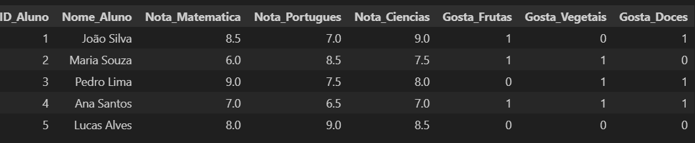

# Projeto: ETL_Apache_Beam_Desempenho_Preferencias
## Descrição:
Este projeto realiza um processo ETL (Extract, Transform, Load) em dois datasets simples: um contendo dados sobre o desempenho escolar dos alunos e outro contendo informações sobre suas preferências alimentares. O objetivo do projeto é integrar essas informações e analisar se existe alguma correlação entre as preferências alimentares dos alunos e seu desempenho em diferentes disciplinas.

## Objetivo:
O objetivo deste projeto é integrar, processar e analisar os dados de desempenho escolar e preferências alimentares utilizando Apache Beam. Com isso, buscamos identificar possíveis padrões entre as preferências alimentares dos alunos e suas notas em matérias como Matemática, Português e Ciências.

## Etapas do Projeto:
### Tratamento dos Dados de Desempenho Escolar:

Limpeza dos dados, removendo quaisquer registros incompletos ou inconsistentes.
Normalização das notas, caso necessário, para padronizar as escalas de avaliação.

### Tratamento dos Dados de Preferências Alimentares:

Conversão de respostas qualitativas (Sim/Não) em valores numéricos para facilitar a análise posterior.
Verificação da consistência dos dados, garantindo que todas as respostas estejam completas.

### Integração dos Datasets:

Combinação dos dois datasets com base no ID_Aluno, criando um dataset unificado que inclui tanto as notas quanto as preferências alimentares de cada aluno.
Ajuste dos dados para garantir que todos os alunos presentes em um dataset também estejam no outro.

### Análise dos Resultados:

Utilização de Pandas para explorar o dataset integrado e realizar análises básicas, como calcular médias de notas por grupo de preferência alimentar.
Geração de gráficos simples que possam ilustrar quaisquer correlações entre preferências alimentares e desempenho escolar.

## Ferramentas e Tecnologias:
- Apache Beam para o processo ETL.
- Pandas para análises exploratórias adicionais.
- **Matplotlib** e **Seaborn** para a geração de gráficos e insights visuais.

## Contato
- linkedin - https://www.linkedin.com/in/diogo-alves-52798926/
